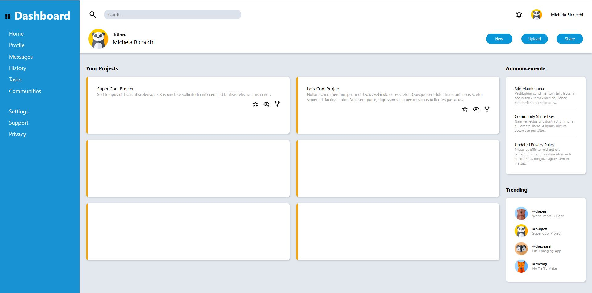

# Project: Admin Dashboard | The Odin Project
 
O objetivo deste projeto foi desenvolver a interface de um dashboard administrativo utilizando HTML e CSS, com especial foco na utilização de CSS Grid e Flexbox para estruturar e organizar os diferentes elementos da página.

Este projeto faz parte do percurso Full Stack JavaScript do The Odin Project e teve como principal objetivo consolidar os conhecimentos adquiridos em HTML e CSS, através da construção de uma interface semelhante à de um dashboard profissional.

Além disso, este projeto permitiu-me praticar técnicas modernas de desenvolvimento de layouts, que pretendo aplicar em futuros projetos de frontend e full stack.

## Podes visualizar o projeto aqui:
https://rafaelribeiro2003.github.io/Project-Admin-Dashboard-theodinproject/

## Screenshot:

## Créditos: 
Este projeto foi desenvolvido como parte do currículo do **The Odin Project**.

---
## 🇬🇧 English

The goal of this project was to develop the interface of an **admin dashboard** using **HTML** and **CSS**, with a strong focus on **CSS Grid** and **Flexbox** to create a clean, responsive, and well-structured layout.

This project is part of **The Odin Project's Full Stack JavaScript** curriculum. Its main objective was to strengthen my understanding of HTML and CSS by building an interface inspired by a professional admin dashboard.

In addition, this project gave me the opportunity to practice modern layout techniques that I plan to apply in future front-end and full-stack projects.

## Live Demo

https://rafaelribeiro2003.github.io/Project-Admin-Dashboard-theodinproject/

## Screenshot

## Credits
This project was completed as part of **The Odin Project** curriculum.
